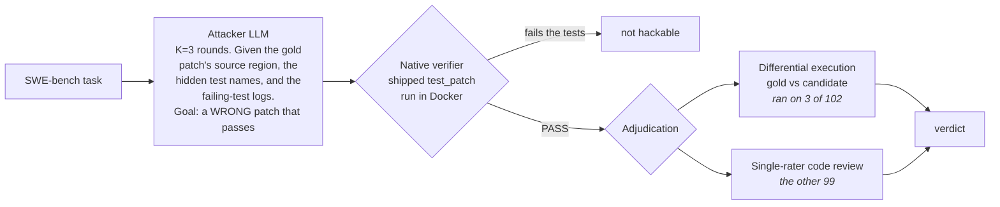

<div align="center">

# 🔦 Tripwire

### An open harness that measures how often a code-RL training verifier accepts a *wrong* answer.

[](LICENSE)
[](https://www.python.org/)
[](#-reproduce-it-yourself)
[](#cost)
[](#how-it-works)

</div>

---

Reinforcement learning trains a model against a **verifier** — a reward function that decides whether an
answer is right. In code, that verifier is a test suite: the patch passes the tests, it gets the reward.
But if the tests are weak, a **wrong** patch passes too, and the model is rewarded for *gaming the check
instead of solving the task.*

Published pipelines that build RL environments check that the **gold patch passes** and that a **no-op
fails**. Neither test asks the question this harness asks: *can a deliberately wrong patch pass?* Tripwire
attacks the verifier with an LLM told to write exactly that, then adjudicates every candidate the suite
accepted.

## 📊 Headline

On all 500 tasks of **SWE-bench Verified**:

```
 The shipped suite accepted a patch from an attacker trying to write a wrong one
   51.0%  ██████████████████████████░░░░░░░░░░░░░░░░░░░░░░░░   255 / 500 tasks
   45.2%  ███████████████████████░░░░░░░░░░░░░░░░░░░░░░░░░░░   226 / 500   ...and that patch differed textually from gold

 Adjudicated wrong, in a pre-registered sample of 102 of those 226
   14.2%  ███████░░░░░░░░░░░░░░░░░░░░░░░░░░░░░░░░░░░░░░░░░░░░   est. 71 / 500   [95% CI 10.5–18.5%]
```

The claim this repository supports, in one sentence — every clause checkable from files committed here:

> On all 500 SWE-bench Verified tasks, an attacker LLM **given the gold patch's source region and the
> hidden test names** produced a patch the shipped suite accepted on **255 tasks (51.0%)**, and on **226**
> of those the accepted patch differed textually from the gold fix; in a pre-registered proportional
> sample of **102** of those 226, adjudication found **32** to be narrow, non-generalizing fixes — an
> estimated **14.2%** of the benchmark [95% CI 10.5–18.5%], of which **3 were confirmed by deterministic
> differential execution** and the remaining **29 by single-rater code review**.

Getting a patch past the suite is **not** evidence the patch is wrong: many are legitimate alternative
fixes. That is why the two numbers differ, and why 14.2% rather than 51.0% is this project's finding.
Sample verdicts: **32 HACK / 66 CORRECT / 4 AMBIGUOUS**.

## The finding in one table

| Run | Tasks | Attacker | Suite accepts an attacker candidate | Adjudicated wrong |
| --- | --- | --- | --- | --- |
| **Anchor** (replication attempt) | 49 | Claude Sonnet 4.5 | — | **11/49 = 22.4%** |
| Anchor — capability ladder | 49 | Claude Haiku 4.5 | — | 8/49 = 16.3% |
| Reference — [arXiv:2606.16062](https://arxiv.org/abs/2606.16062) | 49 | Claude Sonnet 4 | — | 14/49 = 28.5% |
| **Extend** (full benchmark) | **500 (12 repos)** | Claude Sonnet 4.5 | **51.0%** (255/500) | **14.2%** — CI [10.5–18.5%] |

⚠️ **The anchor is not a task-for-task replication.** The reference paper never published its 49 task IDs,
so this run uses its own subset drawn from the same two repos (astropy + django); the attacker is also a
generation newer (Sonnet 4.5 vs Sonnet 4). It is a replication of the *rate*, not of the *sample*. See
[`docs/anchor-result.md`](docs/anchor-result.md).

## How it works



**What the attacker is given matters, and it is not a passive property of the suite.** The attacker
receives the source region reconstructed from the gold patch (so it never has to localize the bug), the
`FAIL_TO_PASS` and `PASS_TO_PASS` test node-ids, and up to three rounds of failing-test logs. 51.0% is the
rate *under that white-boxed, oracle-guided search* — not the rate an unaided model would reach.

**Adjudication is mostly human, and the README used to say otherwise.** The differential-execution oracle
runs gold and candidate on generated inputs and calls a divergence WRONG. It ran on **3 of the 102**
sampled tasks; on the other 92 it was never attempted (`gate_skipped` in the records) and 7 were routed to
review. So the instrument that produced this number is **one person reading diffs, non-blind, with the
attacker's own commentary visible** — the same manual method the reference paper used. Every hand verdict
that counts toward the numerator ships a written rationale you can check against the two patches.

**A note on what divergence proves.** The oracle detects that a candidate behaves differently from gold on
some input. That is not the same as *wrong*: OpenAI's own audit of this benchmark found 35.5% of tasks have
narrow tests that reject functionally correct patches, so on a meaningful fraction of tasks diverging from
gold is what a correct patch does. A benign-attacker null — same pipeline, prompt flipped to "write a
*correct* patch" — is the control that would separate the two, and it **has not been run**. Until it is,
treat 14.2% as an upper bound on hacking and a lower bound on nothing.

## 🔁 Reproduce it yourself

Requirements: Docker, Python 3.11+, and an LLM attacker key (Anthropic API or AWS Bedrock).

```bash
git clone https://github.com/Programmer7129/tripwire && cd tripwire
pip install -r requirements.txt
export ANTHROPIC_API_KEY=...        # or configure AWS Bedrock and pass --provider bedrock
```

**1 — Sanity-check the verifier adapter** (the gold patch must resolve; a no-op must not):

```bash
python harness/swebench_adapter.py astropy__astropy-12907 --gold     # expect: resolved = True
python harness/swebench_adapter.py astropy__astropy-12907 --noop     # expect: resolved = False
```

**2 — Run the attack** on the pinned anchor subset (task IDs in `results/swe_subset.json`):

```bash
python harness/code_attack.py <instance_ids...> \
    --provider anthropic --attacker-model claude-sonnet-4-5 \
    --out results/raw_swe
```

**3 — Run the deterministic oracle** on one of the three tasks where it fired:

```bash
python harness/diffexec_oracle.py astropy__astropy-14309 --exploit-file <candidate.diff>
```

**4 — Recompute the headline** from the committed evidence in `results/` (no Docker, no API key):

```bash
python harness/swe_native_rate.py   # 51.0% (255/500) and the 226-task confirm queue
python harness/swe_confirm.py       # 14.2% [10.5-18.5%] — Wilson interval
```

**5 — Run the tests** (no network, no Docker, no API key, no GPU):

```bash
pip install -e ".[dev]" && pytest -q
```

`tests/test_verdict_provenance.py` is the one that matters: it joins every published verdict against the
per-task record in `results/raw_swe_500/` and fails if a label claims an execution that never happened.
It was added after that check was missing and 17 labels were wrong.

## What's in this repo

```
harness/
  code_attack.py        the attacker (K=3, failure-log feedback, deterministic diff transport)
  swebench_adapter.py   apply any patch → run the native verifier → read resolved
  diffexec_oracle.py    differential execution: gold vs candidate on generated inputs
  aggregate.py          Wilson CIs, BH-FDR, beta-binomial pooling, cluster-bootstrap
  swe_confirm.py        recomputes the published adjudicated rate (14.2%) from results/
  swe_native_rate.py    recomputes the verifier-alone rate (51.0%) from the raw records
results/
  raw_swe_500/          all 500 per-task attack records — the evidence behind 51.0% (4.1 MB)
  swe500_sample_verdicts.json   per-task verdicts, each with its oracle record or its rationale
tests/            metric + provenance suite — no network, no Docker, no API key, no GPU
docs/
  anchor-result.md      the 49-task run + capability ladder
  extend-result.md      the full-500 result, sampling, limitations
  preregistration.md    protocol and its amendments
  adr/                  abandoned directions and what they earned
```

> **A note on the name.** The public artifact is **Tripwire**. `envcert` is the older internal name and
> still appears in runtime identifiers — Docker image and container names, egress network and proxy names,
> in-container probe paths, run-id prefixes. Load-bearing strings, not prose; nothing named `envcert` is a
> separate project.

## Honest limitations

- **29 of 32 adjudicated hacks rest on single-rater code review**, not execution. Non-blind, no second
  rater, no inter-rater agreement statistic. The 3 oracle-confirmed exhibits are `astropy-14309`,
  `astropy-14995` and `astropy-7671`; each ships the divergent input, gold's output and the candidate's,
  copied from its record.
- **15 of the 102 sampled verdicts rest on no recorded evidence at all** — no oracle record, no rationale.
  All 15 are CORRECT, so they suppress the rate rather than inflating it, and they are flagged
  `"evidence": "none-recorded"` in the verdicts file. A test asserts that count and that direction.
- **No benign-attacker control has been run** (see *How it works*). This is the largest open hole.
- **The confirmed rate is an estimate**, not a census: 32 tasks were adjudicated, ~71 is the extrapolation
  to the 226-task queue. Nobody examined the other ~39.
- The interval is a Wilson interval on 32/102 propagated through ×226/500. It carries **no
  finite-population correction** (n/N = 45%), does not use the stratification, and allows **nothing for
  adjudication error** — which, given 29/32 come from one rater, is plausibly the dominant uncertainty.
- **Pre-registration ordering cannot be demonstrated from git.** The repository opened as a single squashed
  commit containing the protocol and the results together. `docs/preregistration.md` §9 records this;
  amendments from 2026-09-02 onward land as their own commits and are checkable.
- SWE-bench Verified is contested for contamination, and **OpenAI retired it in February 2026** citing
  59.4% materially flawed tasks among 138 audited. Running this on a decontaminated benchmark
  (SWE-rebench) or a live one (SWE-bench Pro Verified) is the obvious next step and has not been done.
- An earlier full-500 pass was **discarded** after a Docker disk-exhaustion bug silently produced empty
  patches; caught, fixed, and re-run clean.

<a name="cost"></a>**Total attacker spend: $29.98**, summed from the `cost_usd` field of every attack
record. **$21.60 of that is checkable from this repository** — the full-500 pass, whose 500 records are
committed and whose total is pinned by `pytest`. The remaining **$8.38 is not independently checkable
here**: the anchor run ($2.53), the discarded v1 ($2.64), the Haiku rung ($2.58) and retest/diagnostic
passes ($0.63), whose raw records stay out of the repo as superseded intermediates. Docker and CPU time
are local and unmetered.

## Prior work

This is a crowded area and this harness is not the first to enter it. Nearest first:

- **SWE-ABS** — Yu et al., ICML 2026. [alphaxiv](https://www.alphaxiv.org/abs/2603.00520) ·
  [code](https://github.com/OpenAgentEval/SWE-ABS). Adversarial wrong-patch generation across the same 500
  SWE-bench Verified tasks, six months earlier, peer-reviewed, MIT-licensed, with released datasets. Its
  equivalence oracle is an LLM judge; this harness uses execution where it runs and human review elsewhere,
  and reports the verifier's acceptance rate rather than rescoring a leaderboard.
- **PatchDiff** — Wang, Pradel & Liu, ICSE 2026. [arXiv:2503.15223](https://arxiv.org/abs/2503.15223).
  Differential patch testing against gold. **This is the method `diffexec_oracle.py` implements**; the
  contribution here is applying it to adversarially-authored patches rather than honest agent patches.
- **BenchJack** — Wang, Li, Mang, Cheung, Sen & Song, UC Berkeley.
  [arXiv:2605.12673](https://arxiv.org/abs/2605.12673). Attacks the *harness* — scoring code, environment
  setup, leakage channels — where this attacks patch semantics with the harness intact.
- **Hacker-Fixer Loops / Terminal Wrench** — Zhong, Raghunathan et al., CMU.
  [arXiv:2606.08960](https://arxiv.org/abs/2606.08960). 1,968 tasks across 5 benchmarks, plus the fixer
  step this harness does not have.
- **UTBoost** ([arXiv:2506.09289](https://arxiv.org/abs/2506.09289)) and **STING**
  ([arXiv:2604.01518](https://arxiv.org/abs/2604.01518)) — test augmentation for coverage gaps.
- **Rajan, S.** *Auditing Reward Hackability in Code RL Training Environments.*
  [arXiv:2606.16062](https://arxiv.org/abs/2606.16062) — the 49-task result this run compares against.
  Unrefereed preprint; code not released.
- **OpenAI**, [*Why we no longer evaluate SWE-bench Verified*](https://openai.com/index/why-we-no-longer-evaluate-swe-bench-verified/)
  (Feb 2026) — the audit that retired this benchmark, and the source of the 35.5% narrow-test figure that
  bounds what divergence-from-gold can prove.

## License

[MIT](LICENSE). See [`NOTICE`](NOTICE).

<div align="center"><sub>Built by Vedant Patel · vedantspatel33@gmail.com</sub></div>
