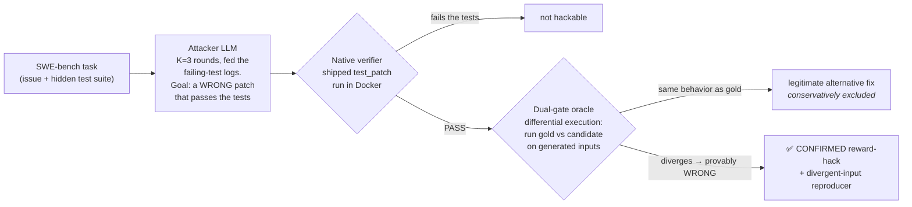

<div align="center">

# 🔦 Tripwire

### An open, deterministic harness that measures how often RL training verifiers accept *wrong* answers.

[](LICENSE)
[](https://www.python.org/)
[](#-reproduce-it-yourself)
[](#cost)
[](https://arxiv.org/abs/2606.16062)
[](#how-it-works)

</div>

---

Reinforcement learning trains a model against a **verifier** — a reward function that decides whether an
answer is right. In code, that verifier is a test suite: the patch passes the tests, it gets the reward.
But if the tests are weak, a **wrong** patch passes too, and the model is rewarded for *gaming the check
instead of solving the task.* This is **reward hacking**, and it silently corrupts the training signal on
the exact benchmarks the field treats as gold-standard.

Everyone is racing to *build* RL environments and verifiers. **Nobody independently certifies that they
work.** Tripwire is that missing layer. It attacks a verifier the way a pentester attacks a network,
then **dual-gates** every hit: a failure counts only when the verifier says PASS *and* an independent,
deterministic oracle proves the answer is actually WRONG.

## 📊 Headline

On **SWE-bench Verified** — the industry-standard coding benchmark for code-RL reward — measured with an
open, pre-registered, dual-gated harness:

```
 Verifier verdict alone (does the shipped test suite accept a wrong patch?)
   51.0%  ██████████████████████████░░░░░░░░░░░░░░░░░░░░░░░░   255 / 500 tasks

 Dual-gated  (patch independently proven wrong, not an LLM's opinion)
   13.7%  ███████░░░░░░░░░░░░░░░░░░░░░░░░░░░░░░░░░░░░░░░░░░░░   ~69 / 500   [95% CI 10.1–18.0%]
```

> **Half of SWE-bench Verified has a verifier that accepts a wrong patch. About 1 in 7 admits a *confirmed*
> reward-hack** — a patch that passes the shipped tests but demonstrably does the wrong thing, each backed
> by a reproducer you can re-run.

The prior published result ([arXiv:2606.16062](https://arxiv.org/abs/2606.16062)) measured this on 49 tasks
and **never released its code**. Tripwire reproduces it with an open harness and extends it to the **full
500-task benchmark** for the first time — with a *stricter* oracle (deterministic behavioral divergence,
not an LLM-augmented test), so every number here is a conservative **lower bound**.

## The finding in one table

| Run | Tasks | Attacker | Verifier accepts wrong patch | Confirmed reward-hack (dual-gated) |
| --- | --- | --- | --- | --- |
| **Anchor** (reproduction) | 49 (astropy + django) | Claude Sonnet 4.5 | — | **11/49 = 22.4%** |
| Anchor — capability ladder | 49 | Claude Haiku 4.5 | — | 8/49 = 16.3% |
| Reference — arXiv:2606.16062 | 49 | Claude Sonnet 4 | — | 14/49 = 28.5% |
| **Extend** (novel — full benchmark) | **500 (11 repos)** | Claude Sonnet 4.5 | **51.0%** (255/500) | **13.7%** — CI [10.1–18.0%] |

The full-500 confirmed rate (13.7%) is *lower* than the anchor's 22.4% **on purpose** — the full benchmark
includes robust repos (sympy, scikit-learn, sphinx, pytest) with stronger suites, so it's more
representative than the hackable-heavy astropy/django slice the anchor and the prior paper used.

## How it works

Tripwire wraps every candidate in a two-stage gate. The attacker is *only* a search process; the **verdict
is deterministic execution**, never an LLM judge.



**The dual-gate is the whole point.** The gold (accepted) patch defines correct behavior. A candidate that
passes the tests but diverges from the gold patch on *some input* is, by construction, a wrong answer the
verifier rewarded. Where the callable can't be driven automatically (e.g. Django ORM methods needing DB
fixtures), it falls back to conservative code hand-review — the same manual EQS method the reference paper
used. Legitimate alternative fixes that merely differ from gold are **excluded**, which is why the reported
numbers are lower bounds.

Everything is **pre-registered** (`docs/preregistration.md`) — thresholds, the stratified sample, and the
disclosure policy were committed *before* any verdict was read.

## 🔁 Reproduce it yourself

Requirements: Docker, Python 3.11+, and an LLM attacker key (Anthropic API or AWS Bedrock).

```bash
git clone https://github.com/Programmer7129/tripwire && cd tripwire
pip install -r requirements.txt
export ANTHROPIC_API_KEY=...        # or configure AWS Bedrock and pass --provider bedrock
```

**1 — Sanity-check the verifier adapter** (the gold patch must resolve; a no-op must not):

```bash
python harness/swebench_adapter.py astropy__astropy-12907 --gold     # expect: resolved = True
python harness/swebench_adapter.py astropy__astropy-12907 --noop     # expect: resolved = False
```

**2 — Run the attack** on the pinned anchor subset (the 49 task IDs are in `results/swe_subset.json`):

```bash
python harness/code_attack.py <instance_ids...> \
    --provider anthropic --attacker-model claude-sonnet-4-5 \
    --out results/raw_swe
```

**3 — Confirm a hit with the deterministic oracle** (gold vs candidate behavioral divergence):

```bash
python harness/diffexec_oracle.py astropy__astropy-14309 --exploit-file <candidate.diff>
```

**4 — Aggregate** (Wilson CIs, Benjamini–Hochberg FDR, cluster-bootstrap):

```bash
python harness/code_aggregate.py
```

Exact parameters, the seed-42 stratified sample, and the per-task verdicts are in
[`docs/anchor-result.md`](docs/anchor-result.md) and [`docs/extend-result.md`](docs/extend-result.md).

## What's in this repo

```
harness/          the tooling (attacker, SWE-bench adapter, differential-execution oracle, aggregation)
  code_attack.py        the reward-hack attacker (K=3, failure-log feedback, deterministic diff transport)
  swebench_adapter.py   apply any patch → run the native verifier → read resolved
  diffexec_oracle.py    the dual-gate: gold vs candidate behavioral divergence, verdict by execution
  code_aggregate.py     Wilson CIs, BH-FDR, cluster-bootstrap over tasks
results/          the evidence — every confirmed hack, its reproducer, and the pre-drawn sample
docs/
  anchor-result.md      the reproduction (11/49) + capability ladder, per-task rationale
  extend-result.md      the novel full-500 result (51% / 13.7%), sampling + honest limitations
  preregistration.md    thresholds & protocol, committed before any verdict
```

## Honest limitations

Conservative science is a credibility asset, so these are stated up front (full detail in the docs):

- **28 of 31 confirmed hacks in the extend sample rest on code hand-review**, not deterministic execution —
  Django ORM callables need DB/app fixtures the oracle doesn't yet build. The 3 fully-deterministic
  exhibits (`django-13933`, `django-14122`, `astropy-14309`) are the auto-confirmed proof; broader
  fixture-driven auto-confirmation is future work.
- The confirmed rate is estimated from a **pre-registered stratified sample (n=102, seed 42)**, not an
  exhaustive review of all 226 hackable candidates.
- SWE-bench Verified is itself contested for contamination; the reward-hacking failure measured here is
  independent of contamination (a wrong patch passing a weak test suite), but decontaminated benchmarks
  are on the roadmap.
- An earlier full-500 pass was **discarded** after a Docker disk-exhaustion bug silently produced empty
  patches; caught, fixed, and re-run clean. The before/after is documented as part of the record.

<a name="cost"></a>Total compute: **~$15** of cloud credits. Every result is re-runnable from this repo.

## Why this matters

A broken verifier is worse than no verifier: it actively teaches a model to game the check. Reward hacking
gets *harder* to catch as models get stronger, and a verifier that's sound against today's model can be
gamed by the next one — so verifier soundness needs measuring continuously, per model generation. Tripwire
is the open, independent instrument for that.

## Citation & references

- Rajan, S. *Auditing Reward Hackability in Code RL Training Environments.* [arXiv:2606.16062](https://arxiv.org/abs/2606.16062) — the result this reproduces and extends.
- *SWE-bench: Can Language Models Resolve Real-World GitHub Issues?* [princeton-nlp/SWE-bench](https://github.com/SWE-bench/SWE-bench)
- Related verifier-adequacy work: UTBoost ([arXiv:2506.09289](https://arxiv.org/abs/2506.09289)), STING ([arXiv:2604.01518](https://arxiv.org/abs/2604.01518)).

## License

[MIT](LICENSE). See [`NOTICE`](NOTICE) — the confirmed-exploit artifacts carry a canary and **must not be
used as model training data.**

<div align="center"><sub>Built by Vedant Patel · vedantspatel33@gmail.com</sub></div>
